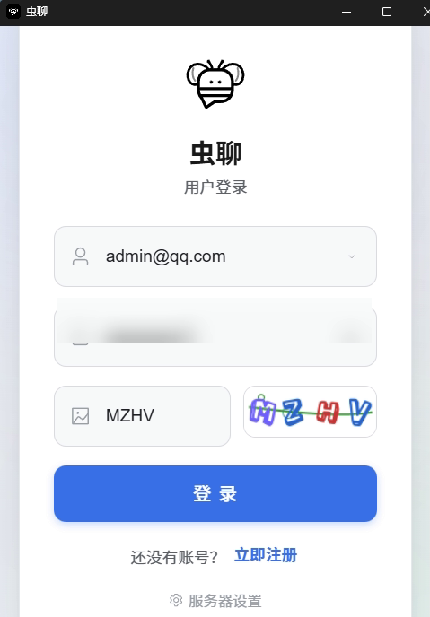

<p align="center">
  
</p>

<h1 align="center">基于 Java、Spring、Netty、Vue、Electron、WebSocket、LLM、MCP 的 IM 聊天（虫聊）WormChat</h1>

<p align="center">
  **WormChat（虫聊）** 是一个全栈即时通讯与音视频会议系统，支持单聊 / 群聊 / AI 机器人对话与多人视频会议
</p>

<p align="center">
  
  
  
  
</p>

## 功能演示

**完整功能演示视频**（单聊 / 群聊 / AI 机器人 / 多人视频会议 / 管理后台，约 9 分钟）：

https://github.com/nb66666nb/wormchat/blob/main/docs/demo/wormchat-demo.mp4

**客户端界面预览：**

| 登录页 |
|:---:|
|  |

<!-- 后续可补充：消息页 docs/images/chat.png、会议页 docs/images/meeting.png、机器人页 docs/images/robot.png -->

## 系统架构

```
┌─────────────────────────────────────────────────┐
│            WormChat 桌面客户端（frontend）          │
│   Electron + Vue 3 + WebRTC + SQLite 本地缓存     │
└────────────────┬───────────────┬────────────────┘
                 │ HTTP (REST)   │ WebSocket (Netty 6061)
                 ▼               ▼
┌─────────────────────────────────────────────────┐
│              服务端（backend）                     │
│  Spring Boot 6060 /api  │  Netty WebSocket 6061   │
│  ┌──────────┬──────────┬──────────┬───────────┐  │
│  │ IM 消息服务 │ 群聊管理  │ 会议服务  │ AI 能力    │  │
│  └──────────┴──────────┴──────────┴───────────┘  │
│       │            │           │          │       │
│  ┌────▼───┐  ┌─────▼────┐ ┌───▼────┐ ┌──▼─────┐  │
│  │ MySQL  │  │  Redis   │ │RabbitMQ│ │ Milvus │  │
│  │(消息分表)│  │(会话/缓存)│ │(集群广播)│ │(RAG向量)│  │
│  └────────┘  └──────────┘ └────────┘ └────────┘  │
└─────────────────────────────────────────────────┘
```

## 功能特性

### 💬 IM 即时通讯
- 单聊 / 群聊：消息撤回、置顶、未读数、会话软删除
- 离线消息拉取、ACK 确认与超时重推（指数退避）
- 雪花算法分布式 ID、消息表按用户分表，支撑高并发
- 客户端 SQLite 本地缓存（消息、会话、群信息镜像同步）

### 👥 群聊系统
- 创建 / 解散 / 退出 / 踢人 / 管理员设置
- 邀请权限控制（仅管理员可邀 / 所有人可邀）
- 成员加入 / 退出事件全群 WebSocket 广播

### 🤖 AI 机器人
- 三类机器人：功能型（会议助手）/ 陪伴型（情感陪伴）/ 混合型
- LLM 对话：OpenAI 兼容协议，默认对接阿里云 DashScope（qwen 系列）
- RAG 知识库：Milvus 向量检索 + MySQL 关键词检索混合
- MCP 工具调用：时间查询、会议查询等
- 情感分析、用户画像、共情策略、对话摘要
- 限流与降级：用户级频率限制、Agent 并发控制、LLM 全局 QPS

### 📹 音视频会议
- WebRTC 多人音视频、屏幕共享
- 会议创建 / 加入 / 结束、参会人状态管理、会中聊天
- 会议密码、会议记录

### 📁 文件传输
- 大文件分片上传、秒传、断点续传
- 单文件最大 5GB、并发上传任务控制

### 🛠 管理后台
- 用户 / 会议 / 群聊管理、操作日志
- 管理员权限（邮箱白名单）

## 技术栈

| 层 | 技术 |
|----|------|
| 客户端 | Electron 33、Vue 3、Vite、Element Plus、Pinia、better-sqlite3、WebRTC |
| 服务端框架 | Java、Spring Boot、MyBatis |
| 通信 | Netty WebSocket（心跳保活、集群广播、重试投递）、REST |
| 存储 | MySQL（消息分表）、Redis（Redisson 分布式锁）、SQLite（客户端缓存） |
| 消息队列 | RabbitMQ（集群广播 / AI 异步回复） |
| AI | DashScope LLM、Milvus 向量库、RAG 混合检索、MCP |
| 构建 | Maven、electron-vite、electron-builder |

## 仓库结构

```
wormchat/
├── frontend/    # Electron + Vue 3 桌面客户端
│   ├── src/main/          # 主进程（SQLite、WebSocket 客户端、IPC）
│   └── src/renderer/      # 渲染进程（聊天 / 会议 / 通讯录 / 管理后台）
└── backend/     # Spring Boot + Netty 服务端
    ├── src/main/java/com/meetchat/
    │   ├── webSocket/     # Netty WebSocket、会话管理、消息投递重试
    │   ├── ai/            # LLM、RAG、MCP、情感分析、限流降级
    │   ├── service/       # 业务逻辑
    │   └── mappers/       # MyBatis Mapper
    ├── sql/               # 建表脚本与压测数据生成
    └── docker-compose.yml # Milvus 一键部署
```

## 快速开始

### 1. 准备环境

| 组件 | 要求 | 用途 |
|------|------|------|
| JDK | 8+ | 运行后端 |
| Maven | 3.6+ | 构建后端 |
| Node.js | >= 18 | 构建前端 |
| MySQL | 8.0 | 业务库 + 消息分表（**必需**） |
| Redis | 5.0+ | 会话/Token/缓存（**必需**） |
| RabbitMQ | 3.8+ | 集群广播/AI 异步回复（单机可不用，见下方说明） |
| Milvus | 2.4+ | RAG 向量检索（**可选**，不用 AI 知识库可不装） |

### 2. 初始化数据库

```bash
mysql -u root -p -e "CREATE DATABASE easymetting DEFAULT CHARACTER SET utf8mb4;"
# 按需执行 backend/sql/ 下的脚本建表
mysql -u root -p easymetting < backend/sql/group_chat.sql
```

### 3. 配置并启动后端

```bash
cd backend
cp src/main/resources/application.properties.example src/main/resources/application.properties
# 编辑 application.properties，必填项见下方【后端配置详解】
mvn spring-boot:run
```

### 4. 启动客户端

```bash
cd frontend
npm install
npm run dev                # 首次启动在登录页「服务器配置」填后端地址
```

详细说明见各子目录 README：
- [frontend/README.md](frontend/README.md)
- [backend/README.md](backend/README.md)

## 后端配置详解

完整配置文件 `backend/src/main/resources/application.properties`（由 `.example` 模板复制而来）。**带 ❗ 的为必填项**：

### 完整配置文件

```properties
# ==================== 服务端口 ====================
# 应用 HTTP 端口（前端请求 http://<服务器IP>:6060/api）
server.port=6060
# Netty WebSocket 端口（前端 IM 长连接）
ws.port=6061
# HTTP 接口统一前缀
server.servlet.context-path=/api

# ==================== MySQL 数据库（❗必填） ====================
# 127.0.0.1:3306 换成你的 MySQL 地址，easymetting 换成库名
spring.datasource.url=jdbc:mysql://127.0.0.1:3306/easymetting?serverTimezone=GMT%2B8&useUnicode=true&characterEncoding=utf8&autoReconnect=true&allowMultiQueries=true\
  &useSSL=false
# 数据库用户名
spring.datasource.username=root
# 数据库密码（改成你自己的）
spring.datasource.password=YOUR_MYSQL_PASSWORD
spring.datasource.driver-class-name=com.mysql.cj.jdbc.Driver
# 连接池（默认值即可，高并发可调大 maximum-pool-size）
spring.datasource.hikari.maximum-pool-size=80

# ==================== Redis（❗必填） ====================
# Redis 地址与端口
spring.redis.host=127.0.0.1
spring.redis.port=6379
spring.redis.database=0

# ==================== RabbitMQ（单机部署可保持默认） ====================
# 单机部署时将下方 ws.broadcast.enabled 改为 false，可完全不装 RabbitMQ
spring.rabbitmq.host=localhost
spring.rabbitmq.port=5672
spring.rabbitmq.username=guest
spring.rabbitmq.password=guest
spring.rabbitmq.virtual-host=/
# 消息转发通道：redis 或 rabbitmq（单机用 redis 即可）
messaging.handle.channel=redis
# WebSocket 集群广播开关（单机部署置 false，跳过 MQ 直接本地推送降低延迟）
ws.broadcast.enabled=true

# ==================== 管理员账号（❗必填） ====================
# 管理员邮箱白名单：列入此处的注册用户将拥有管理后台权限
# 多个用逗号分隔，如：admin@qq.com,root@test.com
# 用户需先用该邮箱注册，再用邮箱+密码登录即可进管理后台
admin.emails=admin@qq.com

# ==================== LLM API Key（❗AI 功能必填） ====================
# 获取地址：https://bailian.console.aliyun.com/ 控制台 -> API-KEY 管理
# 不用 AI 机器人功能可留空（空则 AI 对话降级为默认回复）
ai.llm.api-key=YOUR_DASHSCOPE_API_KEY
# OpenAI 兼容接口地址（默认阿里云 DashScope，可换成任意兼容服务如 DeepSeek/本地 Ollama）
ai.llm.base-url=https://dashscope.aliyuncs.com/compatible-mode/v1
# 模型名（DashScope 下可换 qwen-turbo / qwen-plus / qwen-max 等）
ai.llm.model=qwen3.6-plus
# 单次回复最大 token 数与温度
ai.llm.max-tokens=1024
ai.llm.temperature=0.8
# RAG 知识库开关（不用可置 false，则无需 Milvus）
ai.rag.enabled=true
# MCP 工具调用开关（时间查询、会议查询等 Agent 工具）
ai.mcp.enabled=true
ai.llm.timeout-seconds=60
ai.agent.max-iterations=5

# ==================== Milvus 向量库（仅 RAG 开启时需要） ====================
rag.vector.enabled=true
rag.keyword.enabled=true
rag.milvus.host=localhost
rag.milvus.port=19530
rag.milvus.collection-name=rag_documents

# ==================== AI 限流（默认即可） ====================
# 用户消息频率（条/分钟）
ratelimit.user.message-per-minute=20
# Agent 并发执行数
ratelimit.agent.concurrent=10
# LLM 全局 QPS
ratelimit.llm.qps=50
ratelimit.profile.cooldown-seconds=60

# ==================== 文件存储 ====================
# 上传文件的存储目录（自动创建，Windows 用 D:/xxx 格式，Linux 用 /home/xxx）
project.folder=D:/meetchat-Localfiles
spring.servlet.multipart.max-file-size=500MB
file.chunk.size=5242880

# ==================== 其他（默认即可） ====================
# 雪花算法 workerId（单机 -1 自动推导；集群部署各节点必须指定不同的 0-1023）
snowflake.worker-id=-1
# 日志级别（调试期 debug，生产建议 info）
log.root.level=debug
# ACK 超时重推（指数退避 3s/6s/12s）
ws.retry.initial-delay-ms=3000
ws.retry.max-attempts=3
```

### 关键配置速查

| 你想做什么 | 改哪里 |
|-----------|--------|
| 连接自己的 MySQL | `spring.datasource.url` / `username` / `password` |
| 连接自己的 Redis | `spring.redis.host` / `port` |
| 设置管理员账号 | `admin.emails` 填邮箱 → 用该邮箱**注册** → 登录即有管理后台 |
| 填 AI API Key | `ai.llm.api-key`（阿里云百炼控制台获取） |
| 换 LLM 供应商 | `ai.llm.base-url` + `ai.llm.model`（OpenAI 兼容协议即可） |
| 不装 RabbitMQ | `ws.broadcast.enabled=false` + `messaging.handle.channel=redis` |
| 不装 Milvus | `ai.rag.enabled=false` + `rag.vector.enabled=false` |
| 单机最小依赖 | 只装 MySQL + Redis 即可跑通（AI 功能再装 Milvus） |

## 获取打包文件

前后端可**分别构建、分别下载**，两种方式：

### 方式一：Releases 下载（无需登录，推荐）

打标签自动触发构建并发布到 [Releases](https://github.com/nb66666nb/wormchat/releases)：

```bash
# 仅构建前端（产出 WormChat-x.x.x-setup.exe 安装包）
git tag front-v1.0.0 && git push origin front-v1.0.0

# 仅构建后端（产出可执行 jar）
git tag backend-v1.0.0 && git push origin backend-v1.0.0

# 前后端同时构建
git tag v1.0.0 && git push origin v1.0.0
```

### 方式二：Actions 手动构建

进入 [Actions](https://github.com/nb66666nb/wormchat/actions) 页面 → 选择 **Frontend Build (Electron)** 或 **Backend Build (Spring Boot)** → Run workflow → 构建完成后在该次运行页面底部下载 artifact（需登录 GitHub 账号）。

| Workflow | 产物 | 说明 |
|----------|------|------|
| Frontend Build | `WormChat-x.x.x-setup.exe` | Windows NSIS 安装包（含 ffmpeg） |
| Backend Build | `wormchat-1.0.jar` | Spring Boot 可执行 jar，`java -jar` 直接运行 |

## 性能与压测

- 内置 JMeter 压测方案：千级账号自动生成（`backend/sql/insert_loadtest.py`）、IM 发消息脚本
- Tomcat 线程池 / HikariCP 连接池 / Netty 心跳等参数均已按压测调优
- 消息表分表设计支持水平扩展

## 说明

- `frontend/resources/ffmpeg/` 可执行文件不入库，需自行放置
- 真实配置文件 `application.properties` 不入库，请使用 example 模板
